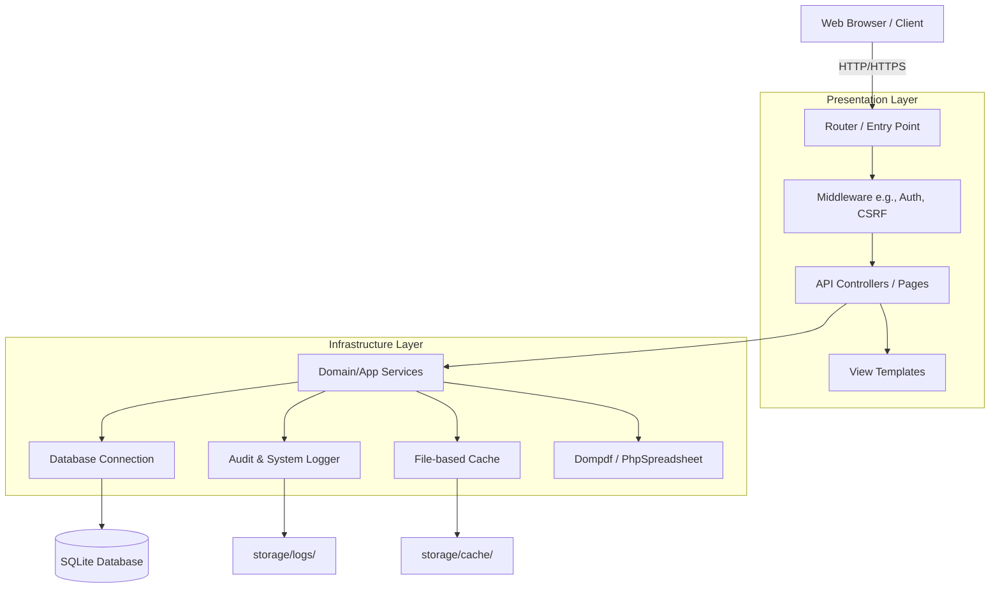
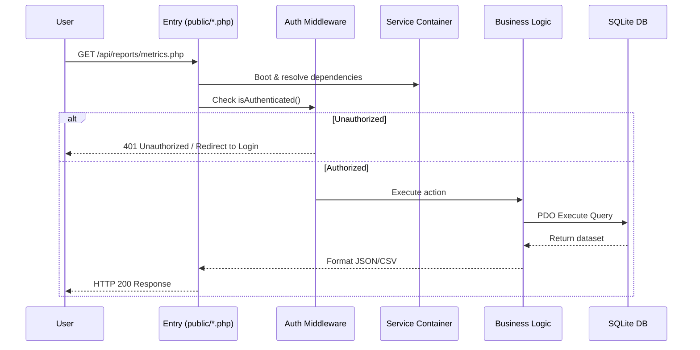

# System Architecture & Technical Overview
**Target Audience:** Systems Administrator  
**Scope:** Server Monitoring Platform (NC Edges Cloud Monitor)

---

## 1. System Architecture Overview

This platform is a custom-built, enterprise-grade server monitoring system designed using **Clean Architecture** principles. It entirely avoids heavy MVC frameworks (like Laravel or Symfony) in favor of a lightweight, highly decoupled, and bespoke PHP 8 architecture.

### High-Level Architecture Diagram



### Core Components & Responsibilities
- **Presentation Layer (`app/Presentation/`)**: Handles HTTP requests, input validation, middleware (authentication and authorization), and JSON/HTML responses.
- **Infrastructure Layer (`app/Infrastructure/`)**: Contains implementations for database connectivity (PDO), authentication sessions, file-based caching, and centralized audit logging.
- **Core Container (`bootstrap/app.php`)**: A bespoke Service Container that handles Dependency Injection (DI). All services are wired and resolved here, ensuring loose coupling.
- **Routing (`router.php` & `public/*.php`)**: Routes requests to appropriate views or API endpoints.

### Technology Stack
- **Language**: PHP 8.1+
- **Database**: SQLite3 (`monitor.db`) accessed via PDO.
- **Frontend**: Vanilla HTML5, CSS3, ES6 JavaScript. Uses **Chart.js** for data visualization.
- **Exporting**: **Dompdf** (PDF generation) and **PhpSpreadsheet** (Excel/CSV generation).
- **Architecture Pattern**: Clean Architecture / Domain-Driven Design (DDD) concepts.

---

## 2. Data Flow Analysis

### End-to-End User Request Lifecycle



### Database Interactions & Persistence
- The system uses a centralized `Connection` class wrapping PHP's PDO.
- All queries use **prepared statements** to prevent SQL injection.
- Persistence is entirely file-based within the `database/` directory.

### Authentication & Authorization Flow
- **Authentication**: Session-based. `AuthenticationService.php` verifies credentials against hashed passwords (`password_verify()`) and issues a PHP Session (`PHPSESSID`).
- **Authorization**: Role-Based Access Control (RBAC). The `hasPermission()` checks if a user is an `admin`, `manager`, or `viewer` before granting access to specific endpoints.
- **Security**: Cross-Site Request Forgery (CSRF) tokens are generated and validated on all state-changing POST requests.

---

## 3. Under-the-Hood Implementation

### Codebase Structure
The project is strictly organized to separate concerns:
- `/app/Core/`: Base interfaces, exceptions, traits, and global helper functions (`env()`, `app()`).
- `/app/Infrastructure/`: Database, Authentication, Logging, and Exporting implementations.
- `/app/Presentation/`: Middleware, HTTP Responses.
- `/bootstrap/`: DI Container wiring (`app.php`).
- `/public/`: Web root. Houses `index.php`, CSS/JS assets, and API endpoint scripts.
- `/resources/views/`: HTML UI templates.
- `/storage/`: Ephemeral data like logs (`app.log`, `security.log`) and cache files.

### Design Patterns
- **Dependency Injection (DI)**: Classes never instantiate their dependencies. They are injected via constructors by the Container.
- **Singleton**: The Database connection and Logger are maintained as singletons in the container.
- **Wrapper Pattern**: `UserWrapper.php` provides a clean, object-oriented interface over raw user session arrays.

### Error Handling & Logging
- **Exception Handling**: A global exception handler in `bootstrap/app.php` catches uncaught exceptions, preventing stack trace leaks and returning safe 500 JSON/HTML errors.
- **Audit Logging**: `AuditService` logs critical user actions (logins, settings changes, data exports) to both the database (`audit_logs` table) and flat files.
- **System Logging**: Standard PSR-3 compliant logger writing to `storage/logs/app.log`.

---

## 4. Infrastructure & Operations

### Deployment Architecture
Because the system is lightweight and uses SQLite, deployment is drastically simplified.
- **Web Server**: Nginx or Apache with PHP-FPM.
- **Database Server**: None required (SQLite is serverless).
- **Environment**: Configuration is managed via a `.env` file in the project root.

### Administrator Controls & Permissions Management
File permissions are critical for this application:
- `/database/monitor.db` must be readable and **writable** by the web server user (e.g., `www-data`).
- `/storage/` must be recursively **writable** for logs and caches.

### Security Controls
- **HTTPS**: TLS is strongly recommended for production.
- **Prepared Statements**: Strict adherence prevents SQLi.
- **Session Security**: Uses `HttpOnly` and `SameSite=Lax` cookies.
- **Rate Limiting/Brute Force**: (Note: Needs to be handled via Web Server configs like `fail2ban` or Nginx `limit_req` as it is not natively built into the PHP layer).

### Backup & Disaster Recovery
- **Database Backup**: Since the DB is a single file (`database/monitor.db`), backups are as simple as running a cron job to copy the file to a secure off-site location (e.g., AWS S3).
- **Zero-Downtime Backups**: Use the SQLite Online Backup API or standard `sqlite3 monitor.db ".backup 'backup.db'"` to avoid locking issues during copy.

---

## 5. Administrator-Focused Insights

### Potential Bottlenecks & Failure Points
1. **SQLite Concurrency**: SQLite handles concurrent reads perfectly, but concurrent writes lock the database. For monitoring systems that receive hundreds of metric inserts per second, this can lead to `SQLITE_BUSY` errors.
   - *Mitigation*: The `Connection` class configures PRAGMA `journal_mode=WAL` (Write-Ahead Logging) and `busy_timeout`.
2. **File Permissions**: The most common point of failure during deployment or updates is the web server losing write access to the `.db` file or `storage/` directory.
3. **Session State**: PHP sessions are stored on disk. In a multi-node load-balanced environment, this would cause "random logouts". (Though SQLite usage implies a single-node deployment).

### Operational Runbooks
- **To reset a lost admin password**:
  ```bash
  php -r "require 'bootstrap/app.php'; app(\App\Infrastructure\Database\Connection::class)->execute('UPDATE users SET password = ? WHERE username = ?', [password_hash('newpass', PASSWORD_DEFAULT), 'admin']);"
  ```
- **To clear cache/logs**:
  ```bash
  rm -rf storage/cache/*
  echo "" > storage/logs/app.log
  ```

---

## 6. Product-to-Code Mapping

Here is how major product features trace back to the underlying codebase:

### 1. The Dashboard (Overview)
- **User Flow**: User navigates to `/dashboard`. They see charts of server uptime and active alerts.
- **Backend Services**: `public/dashboard.php` verifies auth and includes `resources/views/dashboard.php`.
- **APIs Executed**: The frontend JS calls `/api/servers/status.php` to fetch live data.
- **Database Tables**: Reads from `servers` and `server_metrics`.

### 2. Exporting Reports (CSV/PDF/XLS)
- **User Flow**: User visits `/reports`, selects a date range, and clicks "Export Excel".
- **Backend Services**: `public/api/reports/export.php` parses the `format` parameter.
- **Implementation Detail**: Fetches aggregated uptime metrics. Uses `PhpOffice\PhpSpreadsheet` to generate an Excel binary, or `Dompdf` for PDF. Crucially, the script halts execution with `exit;` to safely stream binary data directly to the browser without HTTP corruption.
- **Logging**: `AuditService::log()` tracks who exported data and when.

### 3. Application Settings & Theming
- **User Flow**: User toggles Dark/Light mode or updates global settings.
- **Backend Services**: `public/settings.php` and `ThemeService.php`.
- **Implementation Detail**: Themes are persisted via browser cookies (`theme=dark`), bypassing the need for DB queries on every page load to fetch the user's preference. Global settings are stored in the `settings` database table.

### 4. Authentication Flow
- **User Flow**: User logs in with `admin` / `admin123`.
- **Backend Services**: `public/api/auth/login.php` -> `AuthenticationService::authenticate()`.
- **Implementation Detail**: Validates CSRF token. Compares hash. Sets `$_SESSION['logged_in'] = true`. Emits an audit log entry tagged as `authentication`.
